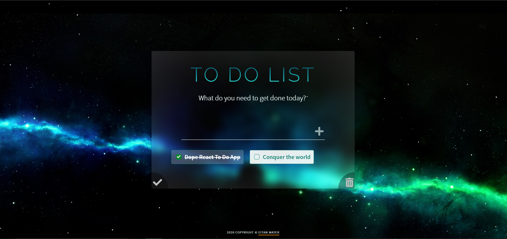

<h1 align="center">Dope To Do List with React 💫</h1>
<p>
  
  
  <a href="https://twitter.com/eitanmayer57" target="_blank">
    
  </a>
</p>

### ✨ Live Here - [dopetodo.wtf](http://dopetodo.wtf)

While being quarantined due to COVID-19, I decided to tackle a classic project **_'React To Do List'_**. Or in my case, **_'React To Do List with manually crafted SVG animations, local storage implementation, mobile compatibility, `Sass`, microinteractions, and hooks utilization'_**.



## 🔧 Prerequisites

```
$ node --version
v10.16.3
```

```
$ npm --version
6.12.0
```

## 👇 Install

Install this repository, and all its dependencies.

    $ git clone https://github.com/ethanpasta/dope-react-todo-list.git
    $ cd dope-react-todo-list
    $ npm install

## 💥 Usage

### For Development

`npm run dev`

### For Production

`npm run build`

## Author

👤 **Eitan Mayer**

-   LinkedIn: [@eitanmayer](https://linkedin.com/in/eitanmayer)

## Show your support

Give a ⭐️ if this project helped you!

## 📝 License

Copyright © 2020 [Eitan Mayer](https://github.com/ethanpasta).<br />
This project is [wtfpl](https://github.com/ethanpasta/dope-react-todo-list/blob/master/LICENSE) licensed.
